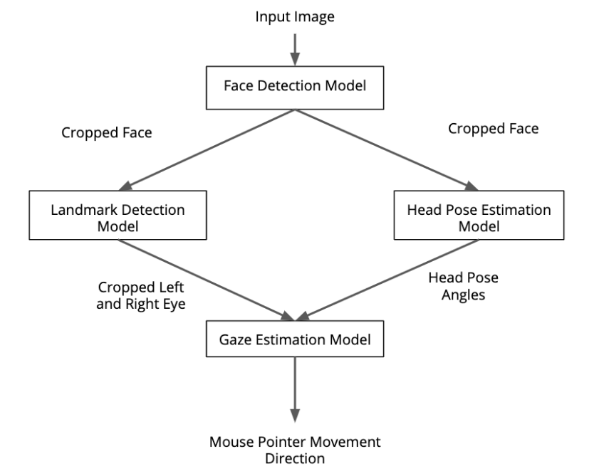

# Computer Pointer Controller

This is a fun application that makes use Intel OpenVino toolkit to run inference on an image or video or camera stream of a person, with four models in pipeline to finally extract eye gazing direction of the person and automatically move mouse pointer there.

## Project Set Up and Installation

Project has following directories:
```
.
|--media/
|  |--<sample_media_files>
|
|--src/
|  |--face_detection.py
|  |--facial_landmarks_detection.py
|  |--head_pose_estimation.py
|  |--gaze_estimation.py
|  |--input_feeder.py
|  |--mouse_controller.py
|  |--test_models.py
|  |--main.py
|  |--benchmark.py
|
|--requirements.txt
|--download_models.sh
```

Models used for making inference are IRs from OpenVino Model Zoo.
These can be found here:
* [face-detection-adas-0001](https://docs.openvinotoolkit.org/latest/_models_intel_face_detection_adas_0001_description_face_detection_adas_0001.html)
* [landmarks-regression-retail-0009](https://docs.openvinotoolkit.org/latest/_models_intel_landmarks_regression_retail_0009_description_landmarks_regression_retail_0009.html)
* [head-pose-estimation-adas-0001](https://docs.openvinotoolkit.org/latest/_models_intel_head_pose_estimation_adas_0001_description_head_pose_estimation_adas_0001.html)
* [gaze-estimation-adas-0002](https://docs.openvinotoolkit.org/latest/_models_intel_gaze_estimation_adas_0002_description_gaze_estimation_adas_0002.html)

OpenVino's [Model Downloader](https://docs.openvinotoolkit.org/latest/_tools_downloader_README.html) was used to download all the models.<br>

**Note:** If not using `download_models.sh` script specify the output directory as `models` to `downloader.py` model downloader script of openvino, while running command in project root directory, so that paths used in `main.py` remain correct.

### Dependencies
Python 3 virtual environment with pip3 on Ubuntu 18.04 was used to develop the app.<br>

Installation of following pre-requisites are required:
- [Intel OpenVino Toolkit](https://docs.openvinotoolkit.org/latest/_docs_install_guides_installing_openvino_linux.html)
- OpenCV 4 (Included in OpenVino Toolkit)
- Following direct python package dependencies (see setup)
  - Numpy
  - PyAutoGUI

To setup the project follow steps in project root directory: 
1. Install [virtualenv](https://pypi.org/project/virtualenv/)
```
      pip install virtualenv
```
2. Create a virutal environment
```
      virtualenv -p python3 env
```
3. Activate the created virtual environment
```
      source env/bin/activate
```
4. Install packages listed in `requirements.txt`
```
      pip3 install -r requirements.txt
```

5. Then download all required models for the app by running:
```
      ./download_models.sh
```
`download_models.sh` can accepts following args and options:<br>
- `-a` option (OPTIONAL): Add this option to download models of all precisions instead of specific precisions used in app.
- `<path>` argument (OPTIONAL): Specify path of OpenVino installation directory as `./download_models.sh <path>`, if it is different from default value of `/opt/intel/openvino`.

## Demo
After installing all the required dependencies and model files with correct precisions, run following command for a quick demo:
```
python3 src/main.py -t video -i media/demo.mp4
```

## Documentation

Code base is moduler with each module having seperate concerns:<br>
- `face_detection.py`: Class for utilizing Face Detection model to extract box coordinates of face of the person in frame. These coordinates are used to crop face from frame.
- `facial_landmarks_detection.py`: Class for utilizing Facial Landmarks Detection model to get the facial landmarks coordinates from face. However, for the app only required eye landmarks are returned which are later used to extract left and right eye.
- `head_pose_estimaion.py`: Class for utilizing Head Pose Estimation model to extract, from face, the head pose angles- yaw, pitch and roll as list with indices in order respectively. These angles are later required in pipeline.
- `gaze_estimation.py`: Class for utilizing Gaze Estimation model which given left and right eye images as well as head pose angles, yields the gaze vectors. Gaze vectors define direction of person's gaze.
- `input_feeder.py`: Convenient class for reading and feeding frames from input media.
- `mouse_controller.py`: Convenient class for controlling mouse pointer.
- `test_models.py`: Script written for purpose of individual testing of models for correct output. Appropriate function can be run to check working of model.
- `main.py`: Script, which is the starting point for the app.
- `benchmark.py`: Script used to benchmark the models.
- `download_models.sh`: Bash script to download all required models from model zoo automatically.

Below image demonstrates pipeline of code:<br>


Following command can be run in project root directory to execute the app:
  ```
  python3 src/main.py -t <media_type> -i <path_to_input_file>
  ```
Arguments to `main.py`-
- `-t`: (Required) Type of media input, `image`, `video` or `cam`.
- `-i`: Path to input file. It will be ignored if type of media input specified is `cam`.
- `-r`: Option to visualize the intermediate inference results from models.
- `-d`: Option to select device to run inference on.


## Benchmarks
Benchmark was done on Intel Core i5-8300H CPU with inputs from `demo.mp4` file present in `media` directory. Following tables show the benchmark stats for models used in the app:<br>
1. Face Detection Model<br>

|             | Load Time(ms) | Total Infernce Time(ms)  | FPS(frames/s) |
|-------------|---------------|--------------------------|---------------|
|**FP16**     |     225       |         9276             |     64        |
|**FP16-INT8**|     454       |         8042             |     74        |
|**FP32**     |     229       |         11060            |     54        |

2. Facial Landmarks Detection Model<br>

|             | Load Time(ms) | Total Infernce Time(ms)  | FPS(frames/s) |
|-------------|---------------|--------------------------|---------------|
|**FP16**     |      55       |          309             |  1924         |
|**FP16-INT8**|      100      |          295             |  2017         |
|**FP32**     |      56       |          358             |  1660         |

3. Head Pose Estimation Model<br>

|             | Load Time(ms) | Total Infernce Time(ms)  | FPS(frames/s) |
|-------------|---------------|--------------------------|---------------|
|**FP16**     |      74       |           740            |     804       |
|**FP16-INT8**|      217      |           545            |     1091      |
|**FP32**     |      64       |           833            |     715       |

4. Gaze Estimation Model<br>

|             | Load Time(ms) | Total Infernce Time (ms) | FPS(frames/s) |
|-------------|---------------|--------------------------|---------------|
|**FP16**     |     90        |          851             |    698        |
|**FP16-INT8**|     283       |          592             |    1005       |
|**FP32**     |     83        |          988             |    602        |

## Results

General trend for the benchmarks of all models hints that models of pricision FP16-INT8 has fastest inference timings. And FP32 is slowest (though, fastest model loading times) in inference. FP16 stands intermediate between these two precisions in stats.<br>

Each individual model (of multiple precisions) is derived/converted from same saved model of a DL framework. However, optimization during conversion is done differently to get a specific precision of model. For precision (or data type) altering, **Quantization** technique is used. Quantization trades better inference speed and lower model size & memory consumption with the accuracy. This is because parameters stored are down sampled from 32 bit floating point values to 16 bit floats or 8 bit ints, for example. And 32 bit floats take up more storage than 16 bit floats, which in turn takes more storage than 8 bit ints. Operations on these data types follow the same trend. Models can be quantized as far as accuracy is acceptable for use case.<br>

FP16-INT8 precision model's parameters are quantized more than FP16 ones, hence former has faster inference speed. While FP32 is intact with it's 32 bit float type of parameter values and are slower.

### Edge Cases
Sometimes if Face Detection model is unable to detect box coordinates for face, nothing is done or fed to subsequent models. Instead app continues to try to detect face in next frame and so on.
